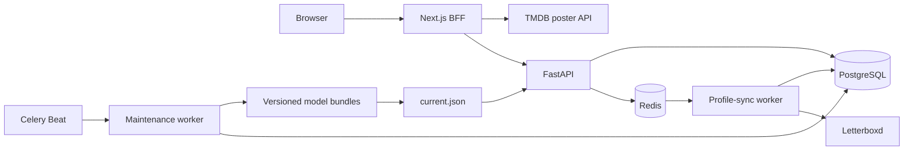

# NexdWatch: Personalized Letterboxd Recommendation Engine

[](https://www.python.org/)
[](https://nextjs.org/)
[](https://www.postgresql.org/)
[](https://redis.io/)
[](https://github.com/facebookresearch/faiss)
[](LICENSE)

**NexdWatch** is a personalized movie recommender built around Letterboxd. It uses a user's ratings to retrieve films through collaborative filtering, combines those results with a popularity baseline, and organizes the final recommendations into shelves such as Hidden Gems, World Cinema, favorite genres, directors, and decades.

Behind the product is a FastAPI/Next.js application with asynchronous profile ingestion, FAISS-based retrieval, PostgreSQL, Celery, and a versioned model lifecycle with validation and rollback. The repository also contains the experiments used to choose the final recommendation architecture.

---

## Key Features

* **Letterboxd profile sync:** Public profiles are synchronized asynchronously, while official Letterboxd export ZIPs provide an offline fallback.
* **Zero-shot personalization:** New users do not need to exist in the training cohort; their current ratings are enough to build a request-time SVD profile.
* **Multi-source retrieval:** Personalized SVD candidates are combined with a controlled popularity baseline before final ranking.
* **Categorized recommendations:** The global ranking is turned into shelves such as Top Picks, Hidden Gems, Because You Liked, World Cinema, favorite genres, directors, and decades.
* **Asynchronous ingestion:** Redis and Celery keep Letterboxd scraping and catalog reconciliation outside request handling.
* **Versioned model lifecycle:** SVD, FAISS, and popularity artifacts are built as validated model bundles that can be promoted or rolled back.
* **Research-backed decisions:** Neural retrieval, LambdaRank, candidate budgets, and RRF settings were evaluated offline rather than selected only by intuition.
* **Same-origin frontend integration:** Next.js Route Handlers proxy FastAPI requests and keep the optional TMDB token server-side.

---

## Recommendation Pipeline

```text
Letterboxd history
        │
        ├── positive-weighted SVD profile ──> exact FAISS top 2,000
        └── controlled popularity ──────────> top 2,000
                                                │
                                      stable candidate union
                                                │
                                      equal-weight RRF, k=60
                                                │
                                      global ranked inventory
                                                │
                                      category policy
                                                │
                                      personalized shelves
```

The collaborative model is a **32-dimensional TruncatedSVD item space**. At request time, positive explicit ratings are combined into a user vector and searched against normalized item embeddings with an exact FAISS `IndexIDMap2(IndexFlatIP)` index.

Candidate generation uses a nominal budget of **2,000 SVD + 2,000 popularity**. Watched films are removed independently from each source, the results are merged without refilling duplicates, and equal-weight reciprocal-rank fusion (`k=60`) produces the global ordering.

SVD and popularity are responsible only for finding and ranking good candidates. The category policy turns that ranking into the shelves shown in the UI and applies product rules such as minimum shelf size, diversity, overlap control, and repetition limits. **Because You Liked** is the main exception: it locally reorders existing candidates by similarity to one highly rated anchor.

See [Recommendation system](docs/recommendation-system.md) for the full ranking and policy specification.

---

## System Architecture



1. **Next.js frontend and BFF:** Handles onboarding, sync polling, ZIP upload, recommendation presentation, and poster resolution. The browser talks to same-origin Route Handlers instead of calling FastAPI directly.
2. **FastAPI application:** Serves ingestion and recommendation endpoints. Model resources and the in-memory policy catalog are loaded once per API process.
3. **PostgreSQL:** Stores users, films, metadata, resolved interactions, and the pending state needed to reconcile unknown films.
4. **Redis + Celery:** Redis carries Celery messages and NexdWatch's own task state, while separate profile-sync and maintenance workers keep user-facing ingestion isolated from heavier maintenance jobs.
5. **Model lifecycle:** The maintenance worker builds validated versioned bundles and promotes them through `current.json`. The API activates a new generation through a normal process restart rather than mutating model state in place.

Public profile synchronization does not block on unknown films: known interactions are persisted immediately, while unresolved slugs are stored in `FilmQueue` / `LogPending` and reconciled later. The ZIP importer follows the same persistence path after resolving export entries against the local catalog.

The production runtime intentionally excludes PyTorch and LightGBM. They remain research-only dependencies.

See [Production architecture](docs/architecture.md), [Data ingestion](docs/data-ingestion.md), and [Model lifecycle](docs/model-lifecycle.md) for the deeper implementation details.

---

## Research and Engineering Decisions

### 1. SVD + popularity over neural retrieval

I evaluated an inductive PyTorch retriever for users that were not present in the training cohort. Under the controlled offline protocol it underperformed both popularity and leakage-free SVD, while its seed-42 depth-500 retrieval covered only 2,837 of 46,990 films. The added runtime and artifact complexity was not justified, so neural retrieval remains research-only.

See [Neural retrieval](experiments/neural_retrieval/README.md).

### 2. RRF over LambdaRank

A 115-feature LightGBM LambdaRank pipeline was evaluated with strict out-of-user folds and full candidate pools. Its global NDCG@20 was `0.05813`, compared with `0.06757` for equal-weight RRF. A separate calibration experiment also failed to find a generalizable improvement over the fixed 50/50, `k=60` configuration.

That made RRF the better production choice: it performed better in the tracked evaluation and avoided another model, checkpoint, and serving dependency.

See [LambdaRank results](experiments/ranker/RESULTS.md).

### 3. Ranking and shelf composition are separate

SVD and popularity answer which unwatched films are plausible, while RRF combines those two rankings. Shelf construction is handled afterward by a separate policy layer.

This keeps rules such as cultural eligibility, category activation, diversity, and repetition limits reviewable without retraining the collaborative model.

### 4. Model generations are immutable

Training happens while the API continues serving its current model. A new generation is written to an isolated bundle, validated, and only then selected through `current.json`. The running API is recycled so every request handled by one process sees one coherent SVD, FAISS, popularity, and `PolicyCatalog` generation.

The serving path was also profiled directly: replacing final ORM-heavy film materialization with the lifespan-owned `PolicyCatalog` reduced the tracked V1.1 warm benchmark from a 1,544.86 ms mean to 115.78 ms on the documented host. These are controlled benchmark results, not a latency SLA.

See [Serving performance](experiments/category_policy/SERVING_PERFORMANCE.md).

---

## Tech Stack

* **Backend:** Python 3.14.6, FastAPI, Pydantic, SQLAlchemy, Alembic
* **Frontend:** Next.js 16, React 19, TypeScript, Tailwind CSS, TanStack Query
* **Database:** PostgreSQL 17
* **Background processing:** Celery 5.6.3, Redis 8
* **Machine learning:** scikit-learn TruncatedSVD, NumPy, FAISS 1.14.3
* **Infrastructure:** Docker, Docker Compose, GitHub Actions
* **External integrations:** Letterboxd scraping/export ingestion, optional TMDB poster metadata
* **Testing:** Pytest, Ruff, ESLint, TypeScript compiler, Next.js production build

---

## Project Structure

```text
nexdwatch/
├── app/
│   ├── api/              # FastAPI routes, schemas, and public mappers
│   ├── domain/           # Internal application contracts
│   ├── services/         # Recommendation, ingestion, task, and activation flows
│   ├── repositories/     # PostgreSQL query boundaries
│   ├── models/           # SQLAlchemy entities
│   ├── db/loaders/       # Bootstrap and profile/catalog reconciliation
│   ├── ml/               # Retrieval, training, and model lifecycle
│   ├── policy/           # User preferences, category proposals, and allocation
│   ├── scraper/          # Letterboxd adapters
│   ├── importers/        # Official export ZIP parsing
│   ├── infrastructure/   # Redis task state and maintenance locks
│   ├── tasks/            # Celery task adapters
│   └── workers/          # Celery configuration and schedules
├── experiments/          # Offline model-selection and serving evidence
├── frontend/             # Next.js application and same-origin BFF
├── tests/                # Production and optional research tests
├── docs/                 # Detailed technical documentation
├── scripts/              # Operational checks
├── data/                 # Local datasets and generated artifacts
├── alembic/              # PostgreSQL migrations
└── manage.py             # Typer operations and research CLI
```

---

## How to Run

Prerequisites: **Docker** and the **Docker Compose plugin**.

### 1. Configure the environment

```bash
cp .env.example .env
```

Set `SECRET_KEY`, `POSTGRES_DB`, `POSTGRES_USER`, and `POSTGRES_PASSWORD`. Keep `POSTGRES_HOST=db` and `POSTGRES_PORT=5432` when using Compose. `TMDB_API_READ_TOKEN` is optional; without it, the frontend falls back to poster placeholders.

### 2. Start PostgreSQL and Redis

```bash
docker compose up -d db redis
docker compose run --rm api alembic upgrade head
```

### 3. Supply data and build the first model

Large source datasets and generated model artifacts are intentionally not committed. A clean clone needs compatible `data/films_data.csv` and `data/users_data.csv` files for bootstrap, or an existing compatible model bundle.

```bash
docker compose run --rm api python manage.py load-all
docker compose run --rm api python manage.py retrain --force
```

See [`data/README.md`](data/README.md) for the expected local data layout.

### 4. Start the application

```bash
docker compose up -d --build api frontend worker maintenance_worker beat
```

The frontend runs at `http://localhost:3000` and FastAPI exposes its health endpoint at `http://localhost:8000/`.

---

## Testing

The normal test suite does not depend on live Letterboxd requests, production datasets, or generated production model artifacts.

```bash
docker compose run --rm --no-deps api ruff check .
docker compose run --rm --no-deps api python -m pytest

docker compose run --rm --no-deps frontend npm run lint
docker compose run --rm --no-deps frontend npm run typecheck
docker compose run --rm --no-deps frontend npm run build
```

Backend tests cover recommendation semantics, ingestion, Redis/Celery task behavior, API contracts, model lifecycle failure paths, and experiment protocols. Frontend CI runs linting, type checking, and a production build on pushes and pull requests targeting `main`.

PyTorch and LightGBM tests are optional because those packages are only required by rejected research experiments. A separate weekly GitHub Actions canary exercises the live Letterboxd scraper adapters without making normal CI dependent on the provider.

---

## Documentation

* [Production architecture](docs/architecture.md) — application layers, runtime components, and request flows.
* [Recommendation system](docs/recommendation-system.md) — SVD retrieval, popularity, RRF, category policy, and allocation.
* [Data ingestion](docs/data-ingestion.md) — username synchronization, ZIP import, and unknown-film reconciliation.
* [Model lifecycle](docs/model-lifecycle.md) — training snapshots, bundles, validation, promotion, activation, and rollback.
* [Operations](docs/operations.md) — Compose services, maintenance schedules, CLI commands, locks, and scraper monitoring.
* [Development and reproducibility](docs/development.md) — local setup, CI, tests, dependency boundaries, and data requirements.
* [Experiment index](experiments/README.md) — model-selection experiments and preserved results.
* [Local data inventory](data/README.md) — local source data and generated artifact ownership.

---

## License

This project is licensed under the [MIT License](LICENSE).

---

## Contact

Cauã Santos – [LinkedIn Profile](https://www.linkedin.com/in/cauafsantosdev/) – cauafsantosdev@gmail.com

Project Link: [https://github.com/cauafsantosdev/nexdwatch](https://github.com/cauafsantosdev/nexdwatch)
