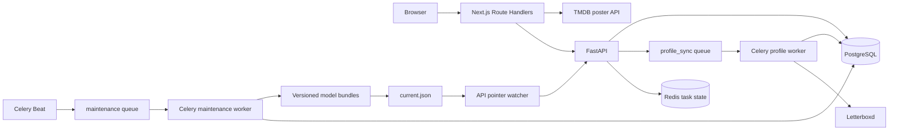

# Production architecture

NexdWatch separates browser integration, API serving, profile ingestion, maintenance, and model construction. Each FastAPI process serves one model generation for its entire lifespan.

## Component ownership

### Next.js frontend and BFF

The App Router frontend serves onboarding at `/` and the categorized feed at `/recommendations`. Browser requests go through same-origin Route Handlers, which call FastAPI through the server-only `NEXDWATCH_API_URL`. A separate server-side handler uses the optional TMDB token for poster lookup.

### FastAPI

FastAPI exposes profile synchronization, export import, task status, health, and recommendation endpoints. During lifespan startup it loads the legacy and categorized recommendation services from the same selected model location. Model arrays, indexes, popularity data, and the policy catalog remain fixed until the process exits.

### PostgreSQL

PostgreSQL 17 stores users, films, normalized metadata, resolved interactions, catalog aggregates, the global `FilmQueue` backlog, and dependent `LogPending` interactions. It is the source for production training snapshots.

### Redis and Celery

Redis provides the Celery broker, public task metadata and ownership, and maintenance locks through separate logical databases. NexdWatch task metadata—not the Celery result backend—is the public task-state source.

Two worker processes isolate workloads:

* the profile worker handles Letterboxd access and profile persistence on the `profile_sync` queue;
* the maintenance worker processes catalog work and model lifecycle tasks on the `maintenance` queue.

Celery Beat publishes the maintenance schedule. Production should run one Beat instance.

## Product flows

Username synchronization creates durable task state, assigns active ownership for the username, and sends scraping to the profile worker. The worker turns provider data into a `ScrapedProfile` and reconciles it in PostgreSQL. The browser polls the task endpoint through the BFF.

Official export ZIPs provide a synchronous fallback. The API validates the archive, resolves rows against the local catalog, and sends the resulting `ScrapedProfile` through the same reconciliation path without calling Letterboxd.

Recommendation requests read the user's current history, generate SVD and popularity candidates, fuse them into one ranked inventory, build category proposals, and allocate the public feed. The legacy recommendation endpoint remains a separate contract.

## Model activation

Training writes an isolated versioned bundle and selects it through `data/models/current.json`. The API pointer watcher validates a newly selected version and requests graceful process shutdown. Compose then starts a new API process, which loads the complete generation during lifespan startup. Serving resources are never hot-swapped within a running process.

The supported deployment is one Uvicorn process per API container in the single-host Compose stack.

Detailed contracts:

* [Recommendation system](recommendation-system.md)
* [Data ingestion](data-ingestion.md)
* [Model lifecycle](model-lifecycle.md)
* [Operations](operations.md)
