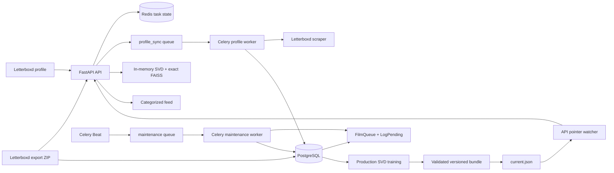

# Production architecture

NexdWatch separates request serving, durable ingestion, low-frequency maintenance,
and model construction. Recommendation resources remain immutable for one FastAPI
lifespan so requests never observe a partially loaded or mixed model version.

## Runtime components

- **FastAPI** accepts imports, exposes task state, serves both recommendation
  contracts, and owns the model-pointer watcher.
- **PostgreSQL 17** is authoritative for users, films, resolved interactions,
  unresolved interaction state, and catalog aggregates.
- **Redis** carries the Celery broker, public task state, synchronization freshness,
  active-task ownership, and maintenance locks in separate logical databases.
- **Celery profile worker** executes blocking Letterboxd profile acquisition and
  persists the resulting profile through the asynchronous database layer.
- **Celery maintenance worker** processes the film backlog, refreshes catalog
  aggregates, evaluates retraining, and builds model bundles.
- **Celery Beat** publishes the four UTC maintenance schedules. Production runs one
  Beat instance.

## Ingestion ownership

Known film slugs become `Log` rows immediately. Unknown slugs become `FilmQueue`
backlog entries with dependent `LogPending` rows. Weekly film maintenance resolves
each film independently and promotes pending interactions only after the film exists.
The database FilmQueue is not a Celery queue.

Official Letterboxd export ZIP ingestion follows the same persistence semantics but
does not scrape missing metadata: unresolved or ambiguous export entries are
reported to the caller.

## Recommendation ownership

The API loads one selected SVD/FAISS/popularity vocabulary and one immutable policy
catalog. Requests query only the user's current history, construct candidates in
memory, and map final policy results to public schemas. The legacy endpoint and the
categorized feed deliberately coexist as different public contracts.

## Model ownership

Training takes a deduplicated PostgreSQL snapshot and builds an isolated immutable
bundle. `data/models/current.json` is the only authoritative version selector.
Training never mutates resources already loaded by a running API. A validated
pointer change causes graceful process recycling; it does not hot-swap NumPy or
FAISS objects while requests are active.

Detailed behavior is documented in [Data ingestion](data-ingestion.md),
[Recommendation system](recommendation-system.md), and
[Model lifecycle](model-lifecycle.md).
